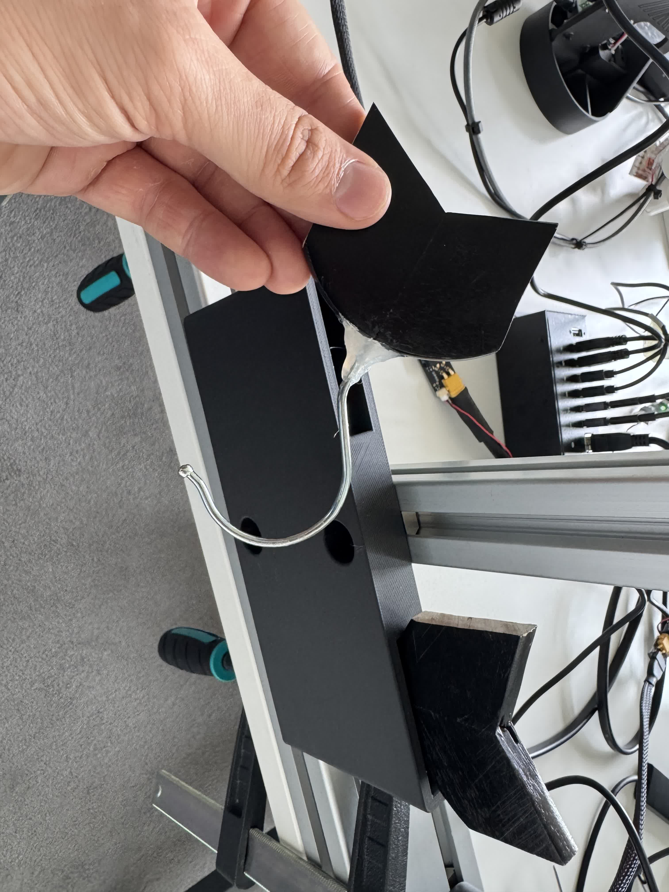
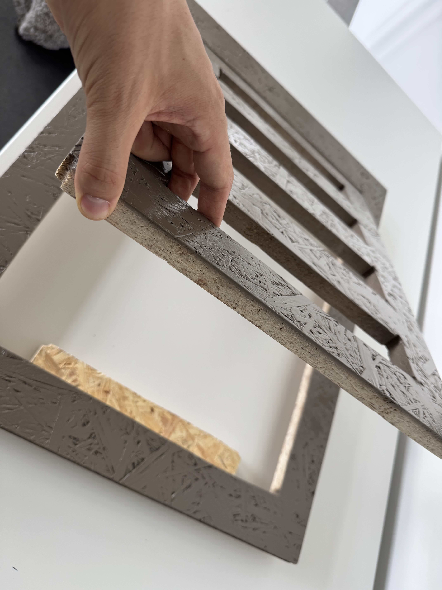
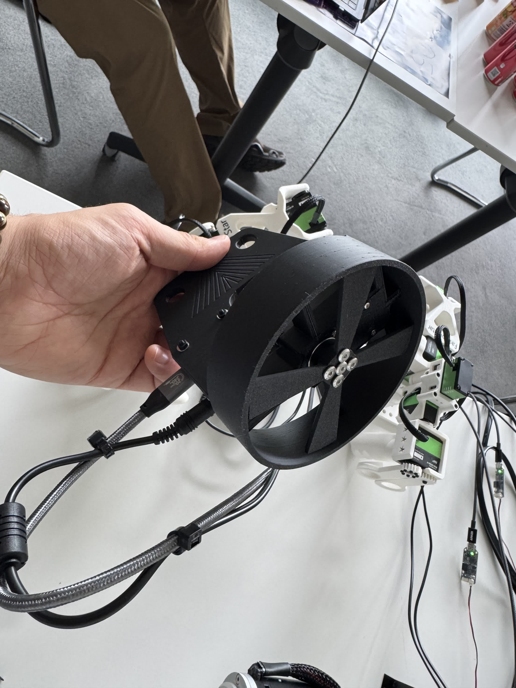

Before the hackathon we had one 1-hour meeting to decide on what idea we would work on.

## Hardware

[@ylewislu](https://github.com/ylewislu) and [@Cpiggott-lab](https://github.com/Cpiggott-lab) prepared 3 props that we could use with our ReBot arms to demonstrate our solution.

1. **Hooks**
   Used two coat hanger hooks that the robot arms could grab to lift up the fake drain.

   

2. **Fake drain**
   A drain cover representing one which would be seen in the streets of any typical city.

   

3. **Chopping device**
   A 3D printed "chopper" that has one Feetech STS3215 attached at the end to demonstrate the chopping of debris inside a drain pipe. We would have used a more suitable motor if we had one... So it's pretty slow.

   

## Software

The only software that was prepared in advance of the hackathon was one python script ([spin_chopper.py](scripts/spin_chopper.py)) used to spin the motor inside the chopping device.
